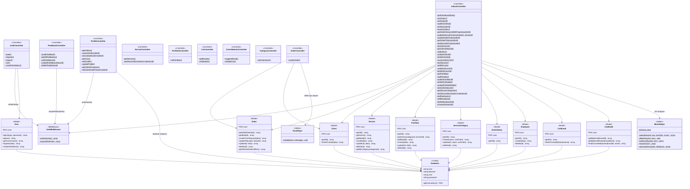

# Диаграмма классов серверной части — AkitaStudio

```mermaid
classDiagram
    %% ─── Конфигурация ────────────────────────────────────────────────
    class Database {
        <<Config>>
        -string host
        -string dbname
        -string user
        -string password
        +getConnection() PDO
    }

    %% ─── Middleware ───────────────────────────────────────────────────
    class AuthMiddleware {
        <<Middleware>>
        +authenticate()$ array
        +requireRole(role)$ array
    }

    %% ─── Модели ───────────────────────────────────────────────────────
    class User {
        <<Model>>
        -PDO conn
        +login(login, password) array
        +logout() array
        +getCurrentUser() array
        +register(data) array
        +createTestAdmin() array
    }

    class Order {
        <<Model>>
        -PDO conn
        +getAllWithDetails() array
        +getById(id) array
        +createFromRequest(data) array
        +updateStatus(id, statusId) array
        +update(id, data) array
        +delete(id) array
        +getFilteredOrders(filters) array
    }

    class Client {
        <<Model>>
        -PDO conn
        +getAll() array
        +findOrCreate(data) array
    }

    class Service {
        <<Model>>
        -PDO conn
        +getAll() array
        +getActive() array
        +getById(id) array
        +create(data) array
        +update(id, data) array
        +delete(id) array
        +getByCategory(categoryId) array
    }

    class CarBrand {
        <<Model>>
        -PDO conn
        +getAll() array
        +findOrCreateByName(name) array
    }

    class CarModel {
        <<Model>>
        -PDO conn
        +getByBrand(brandId) array
        +getByBrandName(brandName) array
        +findOrCreateByName(brandId, name) array
    }

    class Portfolio {
        <<Model>>
        -PDO conn
        +getAll() array
        +getActive(categoryId, serviceId) array
        +getById(id) array
        +create(data) array
        +update(id, data) array
        +delete(id) array
    }

    class ServiceCategory {
        <<Model>>
        -PDO conn
        +getAll() array
        +create(name, sortOrder) array
        +update(id, name, sortOrder) array
        +delete(id) array
    }

    class OrderStatus {
        <<Model>>
        -PDO conn
        +getAll() array
    }

    class Employee {
        <<Model>>
        -PDO conn
        +getAll() array
        +create(data) array
        +delete(id) array
    }

    %% ─── Хелперы ──────────────────────────────────────────────────────
    class MinioHelper {
        <<Helper>>
        -S3Client client$
        +upload(bucket, key, tmpPath, mime)$ string
        +delete(bucket, key)$ void
        +publicUrl(bucket, key)$ string
        +parseUrl(url)$ array
        +generateKey(prefix, fileName)$ string
    }

    class SmsHelper {
        <<Helper>>
        +send(phone, message)$ void
    }

    %% ─── Контроллеры ──────────────────────────────────────────────────
    class AuthController {
        <<Controller>>
        +login()$
        +register()$
        +logout()$
        +me()$
        +createTestAdmin()$
    }

    class ProfileController {
        <<Controller>>
        +getOrders()$
        +cancelOrder(orderId)$
        +rescheduleOrder(orderId)$
        +getCars()$
        +getProfile()$
        +updateProfile()$
        +getOrdersProgress()$
        +getClientOrderPhotos(orderId)$
    }

    class OrderController {
        <<Controller>>
        +createOrder()$
    }

    class ServiceController {
        <<Controller>>
        +getServices()$
        +getServicesByCategory(categoryId)$
    }

    class PortfolioController {
        <<Controller>>
        +getPortfolio()$
    }

    class CarController {
        <<Controller>>
        +getBrands()$
        +getModels()$
    }

    class CarValidationController {
        <<Controller>>
        +suggestBrand()$
        +validateCar()$
    }

    class CategoryController {
        <<Controller>>
        +getCategories()$
    }

    class FeedbackController {
        <<Controller>>
        +sendFeedback()$
        +getAllFeedbacks()$
        +getFeedback(id)$
        +updateFeedbackStatus(id)$
        +deleteFeedback(id)$
    }

    class AdminController {
        <<Controller>>
        +getDashboardStats()$
        +getOrders()$
        +getOrder(id)$
        +updateOrder(id)$
        +deleteOrder(id)$
        +exportOrders()$
        +getOrderServicesWithProgress(orderId)$
        +updateServiceProgress(orderId, serviceId)$
        +uploadOrderPhoto(orderId)$
        +getOrderPhotos(orderId)$
        +deleteOrderPhoto(photoId)$
        +getClientsList()$
        +getClientDetails(id)$
        +addClient()$
        +updateClient(id)$
        +deleteClient(id)$
        +exportClientsCSV()$
        +getServices()$
        +addService()$
        +updateService(id)$
        +deleteService(id)$
        +getPortfolio()$
        +addPortfolio()$
        +updatePortfolio(id)$
        +deletePortfolio(id)$
        +uploadPortfolioMedia()$
        +getOrderStatuses()$
        +getServiceCategories()$
        +getServicesByCategory(categoryId)$
        +getEmployees()$
        +addEmployee()$
        +deleteEmployee(id)$
        +changePassword()$
    }

    %% ─── Зависимости: модели → Database ──────────────────────────────
    User          --> Database
    Order         --> Database
    Client        --> Database
    Service       --> Database
    CarBrand      --> Database
    CarModel      --> Database
    Portfolio     --> Database
    ServiceCategory --> Database
    OrderStatus   --> Database
    Employee      --> Database

    %% ─── Зависимости: контроллеры → Middleware ───────────────────────
    AuthController      --> AuthMiddleware : authenticate
    ProfileController   --> AuthMiddleware : authenticate
    AdminController     --> AuthMiddleware : requireRole(admin)
    FeedbackController  --> AuthMiddleware : requireRole(admin)

    %% ─── Зависимости: контроллеры → Модели ──────────────────────────
    AuthController      --> User
    OrderController     --> Order
    OrderController     --> Client
    ProfileController   --> Database : прямые запросы
    AdminController     --> Order
    AdminController     --> Client
    AdminController     --> Service
    AdminController     --> Portfolio
    AdminController     --> ServiceCategory
    AdminController     --> OrderStatus
    AdminController     --> Employee
    AdminController     --> CarBrand
    AdminController     --> CarModel

    %% ─── Зависимости: контроллеры → Хелперы ─────────────────────────
    AdminController     --> MinioHelper : S3-загрузка
    OrderController     --> SmsHelper   : SMS при заказе
```
