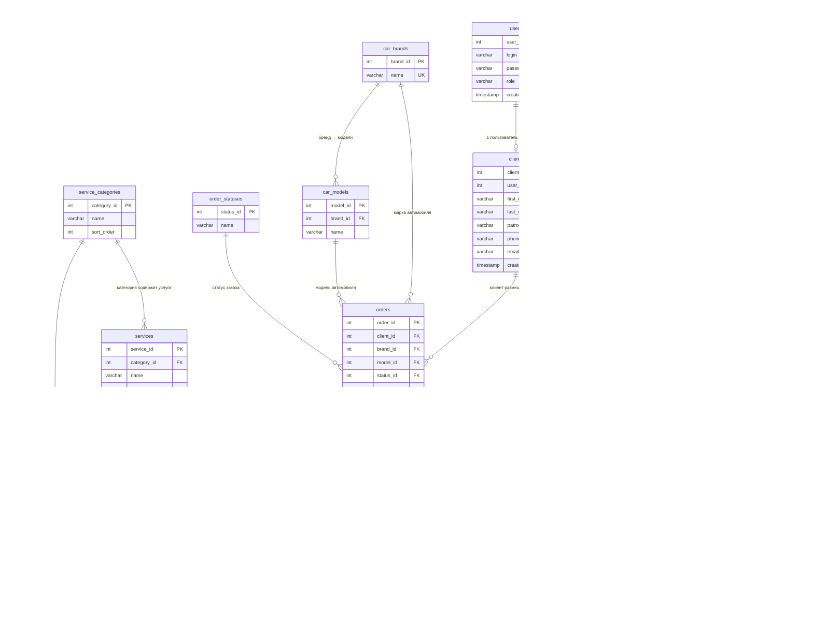

# ER-диаграмма базы данных — AkitaStudio

```mermaid
erDiagram
    users {
        int user_id PK
        varchar login UK
        varchar password_hash
        varchar role
        timestamp created_at
    }

    clients {
        int client_id PK
        int user_id FK
        varchar first_name
        varchar last_name
        varchar patronymic
        varchar phone_number
        varchar email
        timestamp created_at
    }

    service_categories {
        int category_id PK
        varchar name
        int sort_order
    }

    services {
        int service_id PK
        int category_id FK
        varchar name
        text description
        numeric base_price
        int duration_minutes
        boolean is_active
        varchar icon_url
        int sort_order
    }

    car_brands {
        int brand_id PK
        varchar name UK
    }

    car_models {
        int model_id PK
        int brand_id FK
        varchar name
    }

    order_statuses {
        int status_id PK
        varchar name
    }

    orders {
        int order_id PK
        int client_id FK
        int brand_id FK
        int model_id FK
        int status_id FK
        timestamp order_date
        date desired_date
        time desired_time
        text client_notes
        text admin_notes
        numeric total_price
        numeric prepayment
        text notes
    }

    order_services {
        int id PK
        int order_id FK
        int service_id FK
        numeric price_at_moment
    }

    order_services_progress {
        int order_id FK
        int service_id FK
        int progress_percent
        varchar status
        timestamp updated_at
    }

    order_photos {
        int id PK
        int order_id FK
        text photo_url
        varchar caption
        varchar uploaded_by
        int sort_order
    }

    portfolio {
        int id PK
        text video_url
        varchar title
        text description
        int category_id FK
        int service_id FK
        int sort_order
    }

    feedbacks {
        int feedback_id PK
        varchar name
        varchar phone
        varchar email
        text message
        varchar status
        text admin_notes
        timestamp created_at
    }

    employees {
        int employee_id PK
        varchar position
        varchar first_name
        text bio
    }

    users         ||--o|  clients                  : "1 пользователь — 0/1 клиент"
    service_categories ||--o{ services             : "категория содержит услуги"
    service_categories ||--o{ portfolio            : "категория портфолио"
    services      ||--o{ portfolio                 : "услуга в портфолио"
    car_brands    ||--o{ car_models                : "бренд → модели"
    clients       ||--o{ orders                    : "клиент размещает заказы"
    car_brands    ||--o{ orders                    : "марка автомобиля"
    car_models    ||--o{ orders                    : "модель автомобиля"
    order_statuses ||--o{ orders                   : "статус заказа"
    orders        ||--o{ order_services            : "заказ включает услуги"
    services      ||--o{ order_services            : "услуга входит в заказы"
    orders        ||--o{ order_services_progress   : "прогресс выполнения"
    services      ||--o{ order_services_progress   : "прогресс по услуге"
    orders        ||--o{ order_photos              : "фотоотчёт"
```
